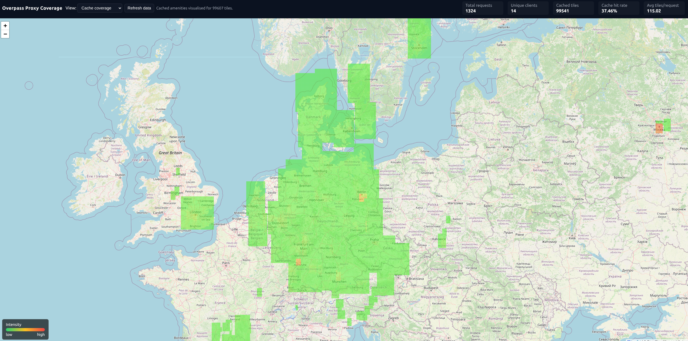
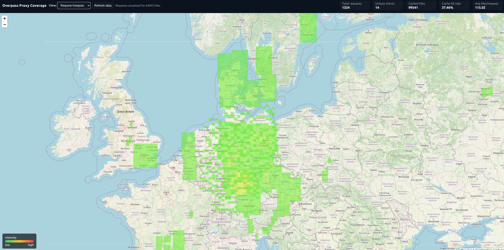

# Overpass Proxy

Overpass API proxy specialised for amenity lookups with Redis-backed tile caching for JSON bounding-box queries. The proxy mirrors the official Overpass API surface so existing clients (like the ToiletFinder iOS app) can switch endpoints without any behavioural changes when querying amenities, while respecting whichever amenity type the caller encodes in the Overpass query.

## Summary

The `overpass-proxy` subproject delivers a production-ready Fastify service that mirrors the public Overpass API surface while
adding Redis-backed geohash tile caching for amenity-focused JSON bounding-box queries. It includes:

- Full TypeScript source code covering request routing, caching, upstream proxying, rate limiting, and telemetry helpers.
- A dual-mode testing setup (Vitest + Supertest) that supports local execution without Docker by default, with optional
  Testcontainers-powered Redis and mock Overpass services when `USE_DOCKER=1`.
- Comprehensive documentation in `specification.md`, including architectural deep-dives and a Mermaid flow diagram that traces
  bootstrap, request handling, cache population, and validation paths end-to-end.

## Features

- Fastify-based HTTP server exposing the `/api/*` Overpass endpoints
- Strict amenity-only handling for `/api/interpreter`; non-JSON or non-amenity queries are rejected with helpful errors, and recognised amenity filters are preserved end-to-end
- Redis-backed geohash tile caching for amenity Overpass JSON bbox queries with stale-while-revalidate refresh, segmented by requested amenity type and persisted via pipelined Redis bulk writes
- Temporary upstream blackouts can pause cache-miss requests briefly and retry with smaller bbox groups once a backend recovers, while cache-hit and stale-cache responses stay immediate
- Request statistics collected per amenity and exposed via JSON endpoints for observing hotspots, cache coverage, and per-amenity geohash coverage
- Structured logging via Pino
- Configurable per-upstream daily request limits with automatic 24-hour lockouts once a quota is reached
- Comprehensive Vitest unit and integration test suites
- GitHub Actions CI workflow running linting and tests with coverage
- Docker & docker-compose setup for development and deployment

## Endpoints

The proxy implements the core Overpass API endpoints:

- `POST /api/interpreter`
- `GET /api/interpreter`
- `GET /api/status`
- `GET /api/timestamp` and `GET /api/timestamp/*`
- `POST /api/kill_my_queries`
- `POST /api/cache/invalidate`
- `GET /api/statistics`
- `GET /api/statistics/geohashCoverage`
- `GET /api/statistics/cacheCoverage`
- `GET /api/statistics/cacheCoverage/area`
- Any other `/api/*` path is transparently proxied upstream

Requests preserve HTTP methods, headers, payloads, and status codes. `/api/interpreter` requires JSON amenity queries with a bounding box; the proxy satisfies the response locally when tiles are cached and fetches amenity tiles upstream on cache misses.

## Configuration

Environment variables are read at startup. Defaults are shown below:

| Variable | Default | Description |
| --- | --- | --- |
| `UPSTREAM_URLS` | *(unset)* | Comma or whitespace separated Overpass API endpoints used for load balancing |
| `UPSTREAM_URL` | `https://overpass-api.de/api/interpreter` | Legacy single Overpass API endpoint (used when `UPSTREAM_URLS` is unset) |
| `UPSTREAM_FAILURE_COOLDOWN_SECONDS` | `60` | Cooldown before retrying a failed upstream |
| `UPSTREAM_REQUEST_TIMEOUT_SECONDS` | `30` | Timeout for individual upstream requests before failing over |
| `UPSTREAM_EXHAUSTED_WAIT_SECONDS` | `2` | Maximum time a cache-miss request waits for the next upstream to leave backoff before returning an error |
| `UPSTREAM_EXHAUSTED_GRACE_SECONDS` | `0` | Extra grace window added after the next upstream retry time before the waiting request gives up |
| `REDIS_URL` | `redis://redis:6379` | Redis connection URL |
| `CACHE_TTL_SECONDS` | `86400` | Cache TTL |
| `SWR_SECONDS` | `CACHE_TTL_SECONDS / 10` | Stale-while-revalidate window |
| `SERVE_STALE_FROM_CACHE` | `true` | Serve stale cache entries immediately and refresh them asynchronously |
| `TILE_PRECISION` | `5` | Geohash precision for tiles |
| `MAX_TILES_PER_REQUEST` | `1024` | Maximum tiles per request |
| `UPSTREAM_RECOVERY_COARSE_PRECISION` | `min(TILE_PRECISION, max(UPSTREAM_TILE_PRECISION + 1, TILE_PRECISION - 1))` | Finer grouping precision used when the upstream pool is temporarily empty and the proxy retries with smaller bbox requests |
| `UPSTREAM_RECOVERY_TARGET_TILES_PER_REQUEST` | `8` | Target fine-tile count per upstream retry group during temporary upstream exhaustion |
| `STALE_REFRESH_COARSE_PRECISION` | `3` | Coarse geohash precision for background stale refresh grouping |
| `STALE_REFRESH_TARGET_TILES_PER_REQUEST` | `max(32, MAX_TILES_PER_REQUEST / 4)` | Target tile count per background stale refresh request |
| `TRANSPARENT_ONLY` | `false` | Disable caching and proxy all requests upstream |
| `TRUST_PROXY` | `false` | Trust `X-Forwarded-For`/`X-Real-IP` headers from a reverse proxy when determining client IPs |
| `UPSTREAM_ORIGIN` | `https://overpass-turbo.eu` | Origin header used when proxying `/api/interpreter` |
| `UPSTREAM_REFERER` | `https://overpass-turbo.eu/` | Referer header used when proxying `/api/interpreter` |
| `UPSTREAM_DAILY_LIMIT` | `-1` | Per-upstream daily request quota (`-1` keeps requests unlimited) |
| `PORT` | `8080` | Listen port |
| `LOG_VERBOSITY` | `info` | Logging verbosity: `errors`, `info`, or `debug` for full request/response details |
| `NODE_ENV` | `production` | Runtime environment |
| `CACHE_INVALIDATION_SECRET` | *(unset)* | Secret keyword required by the cache invalidation API |

The defaults for `TILE_PRECISION` and `MAX_TILES_PER_REQUEST` are tuned for the ToiletFinder iOS client: a precision of 5 keeps
tile counts below the 1 024-tile ceiling even for the app’s widest live-map fetches (~70 km across) and cache-preload passes
(~100 km combined width/height) while still yielding reusable tiles for the 2 km spatial grid used during normal browsing.

### Tile caching lifecycle

`POST /api/interpreter` requests that contain JSON amenity queries with a bounding box are split into geohash tiles at
`TILE_PRECISION` (default 5, capped by `MAX_TILES_PER_REQUEST`, default 1 024). Each tile is keyed as
`tile:<amenity>:<geohash>` and stores its bounding box so upstream responses can be trimmed precisely when written back. The
workflow is:

- **Cache read:** all requested tile keys are fetched in a single Redis `mget`. Entries with `expiresAt` in the past are marked
  stale; missing entries are tracked separately. Cached tiles (fresh or stale) are added to the response immediately, and the
  cache disposition header (`X-Cache`) reports `HIT`, `STALE`, or `MISS` accordingly.
- **Stale-while-revalidate:** tiles become stale when `expiresAt` crosses `CACHE_TTL_SECONDS` (default 86 400 seconds). When
  `SERVE_STALE_FROM_CACHE=true`, fully cached requests return stale data immediately and refresh tiles asynchronously; any
  request that includes cache misses—or has stale data with `SERVE_STALE_FROM_CACHE=false`—awaits a refresh before replying
  so responses include the latest attempted writes. A per-tile lock (`tile:<amenity>:<hash>:lock`) held for `SWR_SECONDS`
  (default one tenth of `CACHE_TTL_SECONDS`, with a 30-second floor) prevents duplicate refreshes. If upstream fetches fail
  and the request cannot be fully resolved from cache, the proxy returns HTTP 503 with `X-Cache` and `X-Cache-Fetched-At`
  headers rather than serving partial tiles. Cache hits and fully stale-covered responses are still returned immediately even
  when every upstream is temporarily in backoff.
- **Handling misses:** missing tiles trigger synchronous upstream fetches. An inflight lock (`:inflight`) keeps concurrent
  callers from stampeding the same fetch. Late callers reuse the fresh write once it lands or fall back to waiting until the
  inflight window expires. If all upstreams are temporarily unavailable because they are cooling down, miss requests wait only
  for the bounded `UPSTREAM_EXHAUSTED_WAIT_SECONDS` window before failing, instead of immediately returning 503.
- **Upstream grouping:** tiles slated for refresh are clustered at `UPSTREAM_TILE_PRECISION` (default two geohash levels
  coarser than `TILE_PRECISION`) so one upstream bbox request can repopulate many fine-grained tiles. Background refreshes
  replan tiles using `STALE_REFRESH_COARSE_PRECISION` (default 3) and `STALE_REFRESH_TARGET_TILES_PER_REQUEST` (default a
  quarter of `MAX_TILES_PER_REQUEST`, min 32) to reduce redundant bbox fetches. Each grouped request uses the canonical
  amenity query and obeys `UPSTREAM_REQUEST_TIMEOUT_SECONDS` (default 30 seconds, bounded by
  `UPSTREAM_FAILURE_COOLDOWN_SECONDS`). When the pool is empty only because all upstreams are in backoff, the proxy can
  temporarily replan the same miss into smaller bbox groups using `UPSTREAM_RECOVERY_COARSE_PRECISION` and
  `UPSTREAM_RECOVERY_TARGET_TILES_PER_REQUEST` so the first recovered upstream is hit with lighter refill work.

### Upstream recovery behavior

- Cacheable misses may wait briefly for the earliest `backoffUntil` instead of failing immediately when every upstream is in cooldown.
- The wait is request-bounded by `UPSTREAM_EXHAUSTED_WAIT_SECONDS` and only applies before any new upstream attempt has started.
- Once an upstream has actually been tried and failed for the current request, the proxy stops waiting and returns the normal error path.
- Transparent proxy requests keep fail-fast behavior; they do not sit in the availability-wait loop.
- Background stale refresh keeps the stale response path fast for callers and warms the cache gently after the response has already been sent.
- A fully stale-covered request can still return `200` with `X-Cache: STALE` while the upstream pool is empty; requests with unresolved tiles still return `503`.
- Backoff metadata is persisted in Redis, including a human-readable `backoffReason`, so cooldown state and its cause survive restarts and appear in statistics snapshots.
- **Persistence:** successful upstream responses are clipped to each fine tile’s exact bbox and written with `fetchedAt` and
  `expiresAt` using Redis pipelines. Presence counters that drive `GET /api/statistics/cacheCoverage` are updated alongside the
  tile payloads.
- **Staleness and refresh frequency:** tiles remain in Redis indefinitely until overwritten. They simply become stale when
  `expiresAt` passes, and the next request through the interpreter endpoint triggers the stale-while-revalidate flow. Setting a
  shorter `CACHE_TTL_SECONDS` or longer `SWR_SECONDS` alters how frequently refreshes occur and how long stale data can be
  served while a refresh is in progress.

### Running behind a reverse proxy

Set `TRUST_PROXY=true` so Fastify respects the original client IP from `X-Forwarded-For`/`X-Real-IP` headers. Example Nginx location block:

```
location / {
  proxy_pass http://overpass-proxy;
  proxy_set_header Host $host;
  proxy_set_header X-Real-IP $remote_addr;
  proxy_set_header X-Forwarded-For $proxy_add_x_forwarded_for;
  proxy_set_header X-Forwarded-Proto $scheme;
}
```

## Running locally

Install dependencies and build the project:

```bash
npm install
npm run build
```

Launch the proxy (expects a Redis instance reachable via `REDIS_URL`):

```bash
npm start
```

### Docker Compose

A ready-to-run docker-compose configuration is provided:

```bash
docker-compose up --build
```

This starts the proxy along with Redis and a mock Overpass service used for integration tests.

The proxy also publishes aggregated usage statistics at `GET /api/statistics`, covering amenity demand, client distribution, cache inventory, geohash hotspots since the start of the current day, and a stale refresh queue overview that summarises background tile updates. Cache coverage is available separately at `GET /api/statistics/cacheCoverage` to reduce payload sizes for dashboards that do not need tile-level inventory detail, while `GET /api/statistics/cacheCoverage/area` returns cache coverage scoped to a bounding box at a requested geohash precision for zoomed-in maps. Per-amenity geohash coverage is exposed via `GET /api/statistics/geohashCoverage` for clients that need precision views without loading cache inventory. These counters are persisted to Redis so they survive restarts. Upstream Overpass instances can be protected with the `UPSTREAM_DAILY_LIMIT` environment variable, which stops routing requests to a backend for 24 hours once its quota is exhausted.

Statistics snapshots now self-heal when cached payloads age out: a pending read from `/api/statistics` triggers an asynchronous rebuild in the background instead of remaining indefinitely pending. Refresh triggers are throttled per target to protect interpreter request latency during repeated dashboard polling.

Cache invalidation is supported at `POST /api/cache/invalidate` when `CACHE_INVALIDATION_SECRET` is configured. The endpoint accepts the secret and bounding box in either query parameters or a JSON body. Bounding boxes can be supplied as a `bbox` string (`south,west,north,east`), an array, or discrete `south`, `west`, `north`, `east` fields. The response includes the resolved bbox, tile count, deleted key counts, and the list of affected amenities.

### Cache invalidation tool

The proxy ships with a lightweight cache invalidation tool at `GET /cache-invalidator.html` (served from `public/cache-invalidator.html`). It provides a map UI for selecting a bounding box and calling the invalidation API without crafting the request by hand.

**Tool features**

- Map-based bbox selection (Shift + drag) with live coordinate display.
- Secret keyword entry that enables the action buttons once populated.
- Single-click invalidation for the selected bbox, plus a clear-selection control.
- Status banner that reports readiness and the success/error response from the API.

**Secret handling**

- The tool requires the same secret keyword configured in `CACHE_INVALIDATION_SECRET`.
- The secret is sent only in the request payload (not in the URL) and is never stored server-side.
- Requests are rejected with HTTP 403 if the secret is missing or incorrect, or if the secret is not configured.

**API behavior**

- **Input:** `POST /api/cache/invalidate` with the secret plus a bbox (`bbox=south,west,north,east`, `[south, west, north, east]`, or `south`/`west`/`north`/`east` fields).
- **Validation:** Responds with HTTP 400 when the bbox is missing, and HTTP 413 if the bbox expands to more than `MAX_TILES_PER_REQUEST`.
- **Result:** Removes cached tiles within the bbox for all amenities and responds with `{ ok, bbox, tileCount, deletedKeys, matchedKeys, tileHashes, affectedAmenities }`.

### Cache preheater tool

`GET /cache-preheater.html` (served from `public/cache-preheater.html`) is a map-driven tool for proactively warming the tile cache before a release, demo, or expected demand surge. It is designed to reduce cold-start latency by prefetching amenities in a controlled, observable way.

**Tool features**

- Map-based bbox selection for defining a warmup region.
- Amenity selector for targeting specific cache segments instead of warming everything.
- Batch size and concurrency controls to avoid overwhelming the upstream Overpass API.
- Live progress indicators for queued, in-flight, and completed batches.
- Automatic backoff messaging when an upstream responds slowly or returns errors.

**Why it exists**

- Prevents cache stampedes during launches or new region rollouts by preloading tiles.
- Gives operators a safe way to prefill cache without writing one-off scripts.
- Makes performance tuning (batch size vs. upstream load) visible and repeatable.

### Statistics map tool

`GET /statistics-map.html` (served from `public/statistics-map.html`) is an operator-focused dashboard that visualizes request hotspots and cache coverage at a glance. It is built to help evaluate cache efficiency and demand geography without exporting data.

**Tool features**

- Heatmap overlays for request hotspots and cache coverage.
- Toggles for amenities, coverage types, and stale tile views.
- Refresh controls with progress feedback to avoid heavy re-fetching during navigation.
- Panel for upstream health and cache summary statistics.
- Cooldown rows expose the stored backoff cause separately from the generic status text.

**Why it exists**

- Quickly surfaces where demand is highest so you can target preheating or adjust TTLs.
- Confirms whether cache coverage is keeping up with real request patterns.
- Provides an at-a-glance operational view for non-CLI users.

#### What the statistics include and how to use them

- **Global totals (persisted across restarts):** total requests, total requested tiles, unique client IPs, cache hits/misses/stales and hit rate, current cached tile count and number of cached amenities, and the top ten geohash hotspots with their request share.
- **Per-amenity breakdown:** requests and average tile counts, unique client IPs, cached tile inventory, cache hit/miss/stale counts with hit rate, 4-character geohash coverage percentages, and the timestamp of the last request.
- **Persistence:** the snapshot is stored in Redis on every update so dashboards and alerts can rely on continuity through restarts.
- **Operational uses:**
  - Identify "hot" geohashes and amenity types to pre-warm or pin in the cache.
  - Spot cache effectiveness regressions (hit/miss ratios) and adjust eviction or TTL policies.
  - Monitor demand diversity (unique clients) and adjust upstream daily limits before outages occur.

#### Retrieving statistics at runtime

- **HTTP:** call `GET /api/statistics` to fetch the current JSON snapshot without touching the interpreter endpoint. Tile cache coverage is exposed separately at `GET /api/statistics/cacheCoverage` for clients that only need the cached tile breakdowns, `GET /api/statistics/cacheCoverage/area` scopes cache coverage to a bbox and precision for map viewports, and per-amenity geohash coverage is served at `GET /api/statistics/geohashCoverage` for viewers that visualise hotspots without inventory payloads.
- **In-process:** the Fastify server wires `RequestStatistics` into the interpreter routes. If you add new routes or background jobs, you can inject the same instance and call `await stats.getSnapshot()`, `await stats.getCacheCoverageSnapshot()`, or `await stats.getGeohashCoverageSnapshot()` to retrieve structured data inside the process without another HTTP request.
- **Time window:** counters continue accumulating until cleared from Redis, so the snapshot survives restarts and day boundaries.

## Testing

The test suite is designed to work both with and without Docker:

- **Default (`npm test`)** – runs unit + integration tests using the in-memory Redis implementation and embedded mock Overpass server. No Docker daemon required.
- **Watch (`npm run test:watch`)** – same as above but in watch mode for quick iteration.
- **Docker-backed (`npm run test:docker`)** – opts into Testcontainers so Redis runs inside Docker when available.
- **Coverage (`npm run test:ci`)** – default non-Docker execution with coverage reporting.
- **Build smoke test (`npm run test:build`)** – compiles the TypeScript project once (`tsc`) and fails on type/build errors.
- **Statistics latency gate (`npm run test:perf:statistics`)** – compares `/api/interpreter` p95 latency at baseline vs. while statistics refresh is continuously triggered, and fails if the delta exceeds the configured budget (default `10ms`, configurable with `PERF_MAX_P95_DELTA_MS`).
- **Full local gate (`npm run verify`)** – runs lint, build smoke test, and test suite in sequence.

```bash
npm test             # unit + integration without Docker
npm run test:watch   # watch mode without Docker
npm run test:docker  # run the suite with Docker dependencies
npm run test:ci      # coverage-enabled run without Docker
npm run test:build   # compile TypeScript once
npm run test:perf:statistics # p95 delta gate for stats refresh impact
npm run verify       # lint + build + tests
```

## Example requests

```bash
# JSON amenity bbox request (cacheable)
curl -X POST http://localhost:8080/api/interpreter \
  -H 'Content-Type: application/x-www-form-urlencoded' \
  --data '[out:json];node["amenity"="cafe"](52.5,13.3,52.6,13.4);out;'

# Validation error when amenity filter missing
curl -X POST http://localhost:8080/api/interpreter \
  -H 'Content-Type: application/x-www-form-urlencoded' \
  --data '[out:json];node(52.5,13.3,52.6,13.4);out;'

# Cache invalidation request
curl -X POST 'http://localhost:8080/api/cache/invalidate' \
  -H 'Content-Type: application/json' \
  --data '{"secret":"YOUR_SECRET","south":52.5,"west":13.3,"north":52.6,"east":13.4}'
```

## Continuous Integration

`.github/workflows/ci.yml` runs linting and tests (with coverage enforcement) on every push and pull request.

## Screenshots



## Operations dashboards

Two static dashboards ship in `public/` to help operators observe coverage and pre-warm tiles:

- `public/statistics-map.html` shows request hotspots, request coverage, and cache coverage overlays with a progress bar,
  deduplicated geohash overlays, stale coverage colouring, and a collapsible upstream health panel for diagnosing routing or
  quota issues in real time. Use the dropdown to switch visualisations or the toggle to hide upstreams.
- `public/cache-preheater.html` targets manual preload runs with live progress, error tracking, and memory-friendly batching so
  large geohash ranges can be warmed without exhausting the browser.
- `public/cache-invalidator.html` provides a map-based UI for selecting a bounding box and sending an invalidation request. The
  secret keyword must match `CACHE_INVALIDATION_SECRET`, and the page reports deleted key counts and affected amenities.
